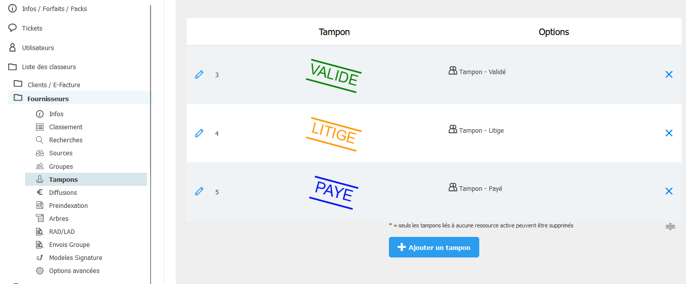
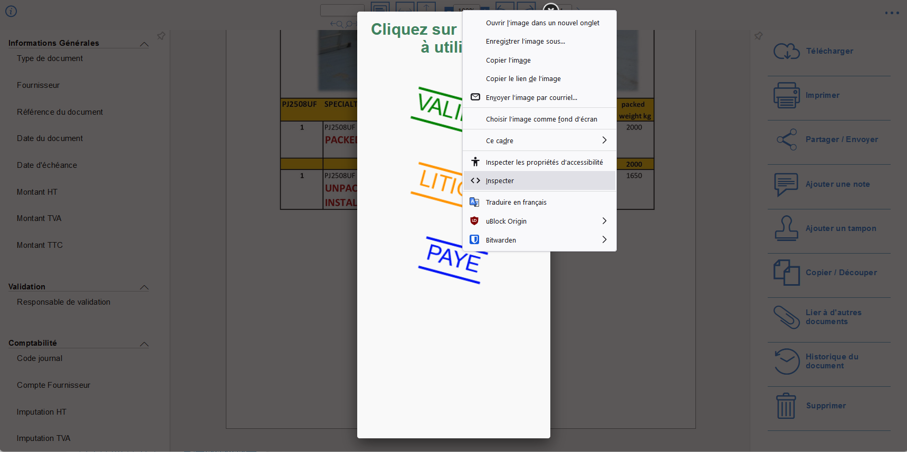

<!-- Improved compatibility of back to top link: See: https://github.com/othneildrew/Best-README-Template/pull/73 -->
<a name="readme-top"></a>
<!--
*** Thanks for checking out the Best-README-Template. If you have a suggestion
*** that would make this better, please fork the repo and create a pull request
*** or simply open an issue with the tag "enhancement".
*** Don't forget to give the project a star!
*** Thanks again! Now go create something AMAZING! :D
-->


<!-- PROJECT SHIELDS -->
<!--
*** I'm using markdown "reference style" links for readability.
*** Reference links are enclosed in brackets [ ] instead of parentheses ( ).
*** See the bottom of this document for the declaration of the reference variables
*** for contributors-url, forks-url, etc. This is an optional, concise syntax you may use.
*** https://www.markdownguide.org/basic-syntax/#reference-style-links
-->
[![Stargazers][stars-shield]][stars-url]
[![Issues][issues-shield]][issues-url]
[![MIT License][license-shield]][license-url]
[![LinkedIn][linkedin-shield]][linkedin-url]


<!-- PROJECT LOGO -->
<br />
<div align="center">
  <a href="https://github.com/FlavienFe/autoZeenDoc">
    
  </a>

<h3 align="center">autoZeenDoc</h3>

  <p align="center">
    Automate ZeenDoc’s website actions
    <br />
    <a href="https://github.com/FlavienFe/autoZeenDoc"><strong>Explore the docs »</strong></a>
    <br />
    <br />
    <a href="https://github.com/FlavienFe/autoZeenDoc">View Demo</a>
    ·
    <a href="https://github.com/FlavienFe/autoZeenDoc/issues">Report Bug</a>
    ·
    <a href="https://github.com/FlavienFe/autoZeenDoc/issues">Request Feature</a>
  </p>
</div>


<!-- TABLE OF CONTENTS -->
<details>
  <summary>Table of Contents</summary>
  <ol>
    <li>
      <a href="#about-the-project">About The Project</a>
      <ul>
        <li><a href="#built-with">Built With</a></li>
      </ul>
    </li>
    <li>
      <a href="#getting-started">Getting Started</a>
      <ul>
        <li><a href="#prerequisites">Prerequisites</a></li>
        <li><a href="#installation">Installation</a></li>
      </ul>
    </li>
    <li><a href="#usage">Usage</a></li>
    <li><a href="#license">License</a></li>
    <li><a href="#contact">Contact</a></li>
  </ol>
</details>


<!-- ABOUT THE PROJECT -->
## About The Project


<p align="right">(<a href="#readme-top">back to top</a>)</p>


### Built With

* [![NodeJS][Node.js]][Node-url]
* [![Puppeteer][Puppeteer.js]][Puppeteer-url]

<p align="right">(<a href="#readme-top">back to top</a>)</p>


<!-- GETTING STARTED -->
## Getting Started

### Prerequisites

* Install [NodeJS][Node-url]
* npm
  ```sh
  npm install npm@latest -g
  ```

### Installation

1. Clone the repo
   ```sh
   git clone https://github.com/FlavienFe/autoZeenDoc.git
   ```
2. Install NPM packages
   ```sh
   npm install
   ```
3. Grab the IDs for your stamps either:
  * In the admin panel 
    <br/>
  * If you don’t have access to the admin panel, use the developper console
    * On an open document right click and click inspect on the stamp you want to know the Id <br/>
    * the Id of the img tag includes the stamp’s Id
4. Enter your key codes and stamp IDs according to the example in `main.js`
   ```js
    const keyBinds = {
      //keyCode: id_tampon,
      "KeyV":1,
      "KeyR":2,
      "KeyN":-1,
    }
   ```
   (for a list of key codes see the event.code on [this website](https://www.toptal.com/developers/keycode))

<p align="right">(<a href="#readme-top">back to top</a>)</p>


<!-- USAGE EXAMPLES -->
## Usage

Open a list view of documents, open the first one you want to work on, and press a key entered on step 4 of installation to automatically put the stamp down and open the next document in the list.


<p align="right">(<a href="#readme-top">back to top</a>)</p>


<!-- LICENSE -->
## License

Distributed under the CC-NC License. See `LICENSE.md` for more information.

<p align="right">(<a href="#readme-top">back to top</a>)</p>


<!-- CONTACT -->
## Contact

Flavien Fechino - flavien.fechino@gmail.com

Project Link: [https://github.com/FlavienFe/autoZeenDoc](https://github.com/FlavienFe/autoZeenDoc)

<p align="right">(<a href="#readme-top">back to top</a>)</p>


<!-- MARKDOWN LINKS & IMAGES -->
<!-- https://www.markdownguide.org/basic-syntax/#reference-style-links -->
[contributors-shield]: https://img.shields.io/github/contributors/FlavienFe/autoZeenDoc.svg?style=for-the-badge
[contributors-url]: https://github.com/FlavienFe/autoZeenDoc/graphs/contributors
[forks-shield]: https://img.shields.io/github/forks/FlavienFe/autoZeenDoc.svg?style=for-the-badge
[forks-url]: https://github.com/FlavienFe/autoZeenDoc/network/members
[stars-shield]: https://img.shields.io/github/stars/FlavienFe/autoZeenDoc.svg?style=for-the-badge
[stars-url]: https://github.com/FlavienFe/autoZeenDoc/stargazers
[issues-shield]: https://img.shields.io/github/issues/FlavienFe/autoZeenDoc.svg?style=for-the-badge
[issues-url]: https://github.com/FlavienFe/autoZeenDoc/issues
[license-shield]: https://img.shields.io/github/license/FlavienFe/autoZeenDoc.svg?style=for-the-badge
[license-url]: https://github.com/FlavienFe/autoZeenDoc/blob/main/LICENSE.md
[linkedin-shield]: https://img.shields.io/badge/-LinkedIn-black.svg?style=for-the-badge&logo=linkedin&colorB=555
[linkedin-url]: https://www.linkedin.com/in/flavienfechino/
[product-screenshot]: images/screenshot.png
[Node.js]: https://img.shields.io/badge/Node.js-43853D?style=for-the-badge&logo=node.js&logoColor=white
[Node-url]: https://nodejs.org/en
[Puppeteer.js]: https://img.shields.io/badge/Puppeteer-38B2AC?style=for-the-badge&logo=node.js&logoColor=white
[Puppeteer-url]: https://pptr.dev/
[Next.js]: https://img.shields.io/badge/next.js-000000?style=for-the-badge&logo=nextdotjs&logoColor=white
[Next-url]: https://nextjs.org/
[React.js]: https://img.shields.io/badge/React-20232A?style=for-the-badge&logo=react&logoColor=61DAFB
[React-url]: https://reactjs.org/
[Vue.js]: https://img.shields.io/badge/Vue.js-35495E?style=for-the-badge&logo=vuedotjs&logoColor=4FC08D
[Vue-url]: https://vuejs.org/
[Angular.io]: https://img.shields.io/badge/Angular-DD0031?style=for-the-badge&logo=angular&logoColor=white
[Angular-url]: https://angular.io/
[Svelte.dev]: https://img.shields.io/badge/Svelte-4A4A55?style=for-the-badge&logo=svelte&logoColor=FF3E00
[Svelte-url]: https://svelte.dev/
[Laravel.com]: https://img.shields.io/badge/Laravel-FF2D20?style=for-the-badge&logo=laravel&logoColor=white
[Laravel-url]: https://laravel.com
[Bootstrap.com]: https://img.shields.io/badge/Bootstrap-563D7C?style=for-the-badge&logo=bootstrap&logoColor=white
[Bootstrap-url]: https://getbootstrap.com
[JQuery.com]: https://img.shields.io/badge/jQuery-0769AD?style=for-the-badge&logo=jquery&logoColor=white
[JQuery-url]: https://jquery.com 
